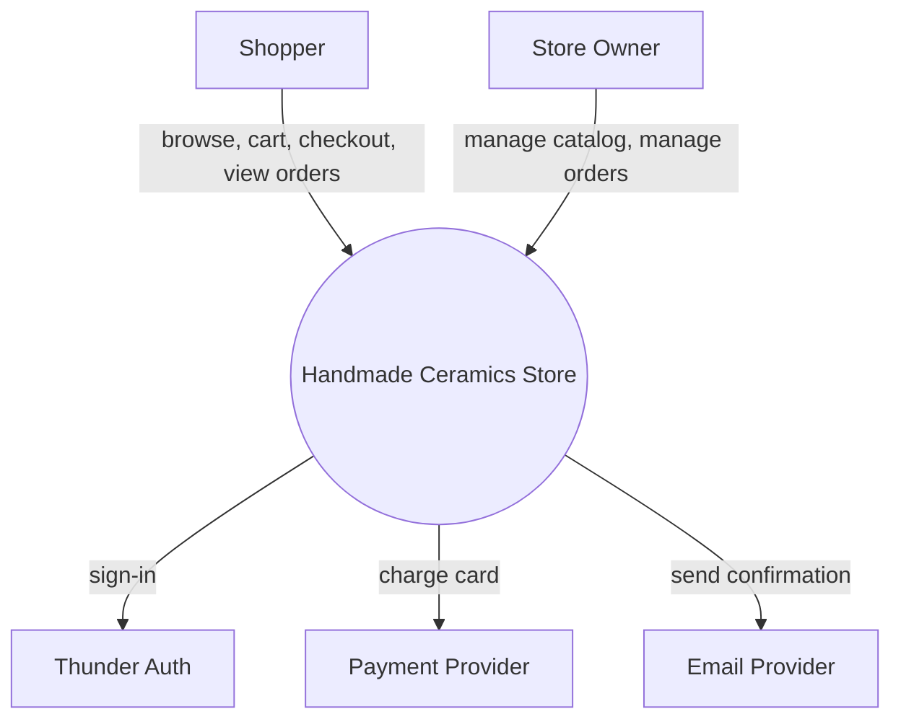
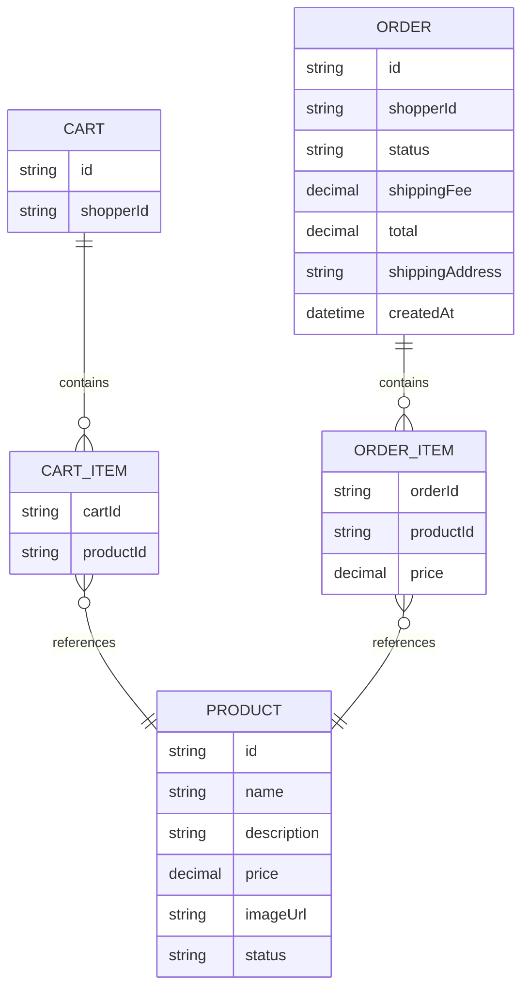
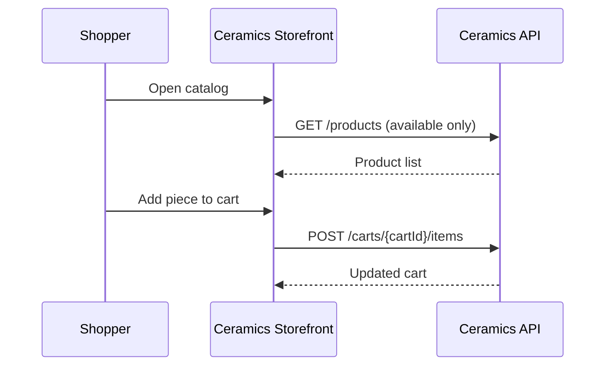
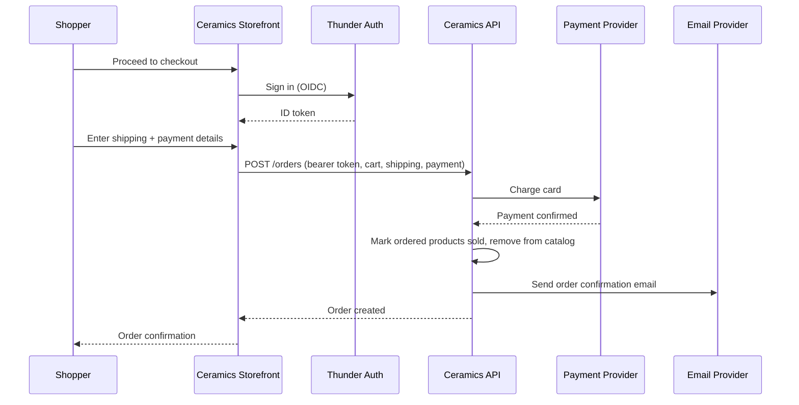
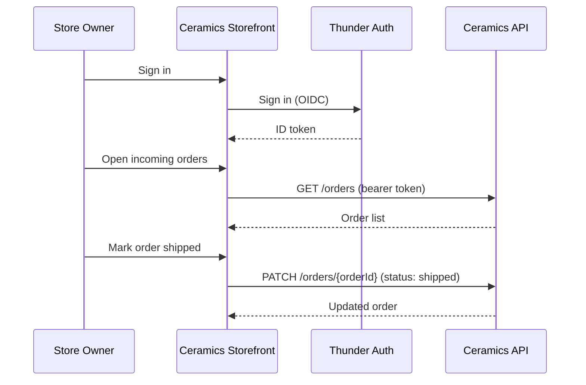

# Handmade Ceramics Store — Design

## Overview

A single-seller online store for handmade ceramics. The **Ceramics Storefront**
(React SPA) serves an anonymous, browsable catalog of one-of-a-kind pieces and,
after Thunder sign-in, a cart/checkout flow for Shoppers and catalog/order
management for the Store Owner. The **Ceramics API** (Ballerina service) owns
the catalog, cart, checkout, and order lifecycle, calling out to a payment
provider to collect payment and an email provider to send order confirmations.
Because every piece is unique, a sale removes it from the catalog immediately.

## Context (C1)

## Domain model (ER)

`PRODUCT.status` is `available` or `sold` — a sold product is excluded from the
public catalog. `ORDER.status` moves `new` → `shipped` → `delivered`.

## Key flows

### Browse and add to cart

### Checkout

### Store Owner order fulfillment

